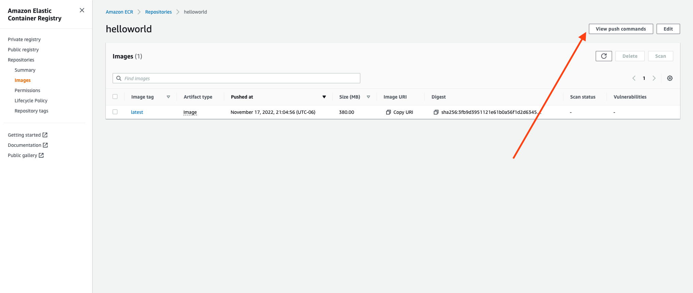

# Containerize Hello World Java Application and Push the Image to Docker Hub and AWS ECR


### Part 1: Containerize Hello World Java Application

#### 1. Install Docker on AWS EC2 (Amazon Linux 2):

Add the below snippet to the `user data` during the creating of the EC2 instance.

```
#! /bin/sh
yum update -y
amazon-linux-extras install docker
service docker start
usermod -a -G docker ec2-user
chkconfig docker on
```

---

#### 2. Containerize Hello World Java Application:

1. Create a `Dockerfile` in the opt folder:

```
cd /opt/ 
sudo mkdir helloworld && cd helloworld
sudo nano Dockerfile
```

2. Paste the below snippet into the Dockerfile and save it:

```
# ------------
# A custom docker image with OpenJava 11, Tomcat 9 with default ROOT and HelloWorld applications
# The valid uri are / and /HelloWorld
# ---------------------------------------------------------------------------------------------

FROM openjdk:11
MAINTAINER Greatlearning

RUN apt update \
    && apt install -y wget \
    && mkdir /opt/tomcat/

RUN wget https://d6opu47qoi4ee.cloudfront.net/tomcat/apache-tomcat-9.0.53.tar.gz \
    && tar xvfz apache*.tar.gz \
    && mv apache-tomcat-9.0.53/* /opt/tomcat/. \
    && cd /opt/tomcat/webapps \
    && wget https://d6opu47qoi4ee.cloudfront.net/HelloWorld.war \
    && java -version

WORKDIR /opt/tomcat/webapps

EXPOSE 8080

CMD ["/opt/tomcat/bin/catalina.sh", "run"]
```

> Note: to save the file using `nano` text editor: 1. hold down `ctrl` and click `x`. 2. Click `y`. 3. click enter


3. Build and run the container:

```
docker build -t helloworld .
```

```
docker run -d -p 80:8080 helloworld
```


4. Access the HelloWorld Java application:

- Open port `80` on the EC2 security group to your local IP address.

- Plug in the public IP address of the EC2 instance followed by the `/HelloWorld` as shown below:

```
http://{EC2-public-IP-Address}/HelloWorld
```

> Note: it's an `http` protocol, NOT `https`.

### Part 2: Push the Hello World Java Application Image to Docker Hub:

1. Create a free [Docker Hub](https://hub.docker.com/) account.

2. Create a public repository named `helloworld`.

3. Login to Docker Hub from the EC2:

```
docker login --username={your-username}
```
You will be prompted to enter your password.

4. Tag the image:

```
docker tag helloworld:latest {your-username}/helloworld:latest
```


5. Push the image to Docker Hub:

```
docker push {your-username}/helloworld:latest
```

---

### Part 3: Push the Hello World Java Application Image to AWS ECR:

1. navigate to the AWS ECR service.

2. Create a private repository named `helloworld` in the AWS ECR.

>Note: the name of the repository must be the same as the name of the image.


Important: the below commands from 3-5 can be obtained from the AWS ECR service by clicking on the `View push commands` button in the repository as shown below:



3. Login to AWS ECR from the EC2:

```
aws ecr get-login-password --region us-east-1 | docker login --username AWS --password-stdin {your-aws-account-id}.dkr.ecr.us-east-1.amazonaws.com
```

4. Tag the image:

```
docker tag helloworld:latest {your-aws-account-id}.dkr.ecr.us-east-1.amazonaws.com/helloworld:latest
```

5. Push the image to AWS ECR:

```
docker push {your-aws-account-id}.dkr.ecr.us-east-1.amazonaws.com/helloworld:latest
```

---


