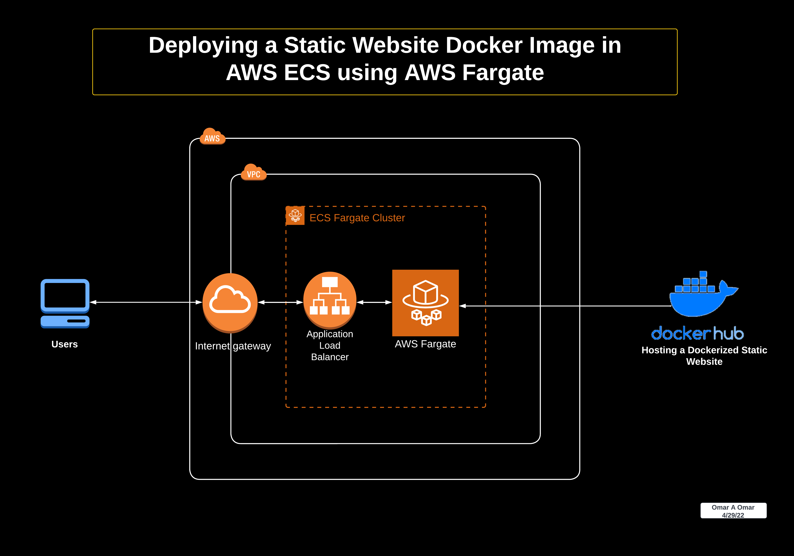

### Pull the Docker Image from Docker Hub and Deploy it to AWS ECS using Fargate (serverless)

In lab 1, we have Dockerized our static website. In this lab, we will create an AWS ECS cluster and will use the Docker image to deploy our website using AWS Fargate. [AWS Fargate](https://aws.amazon.com/fargate/) is a serverless compute service for containers. It lets us focus on building applications without managing servers. AWS Fargate is compatible with AWS ECS and AWS EKS.  

 

**Note:**  `docker.io/docker push omarcloud20/mysite:latest` is the URI that we will use to pull the image from Docker Hub. 

 

 

---

 

### The Architecture Diagram

 

