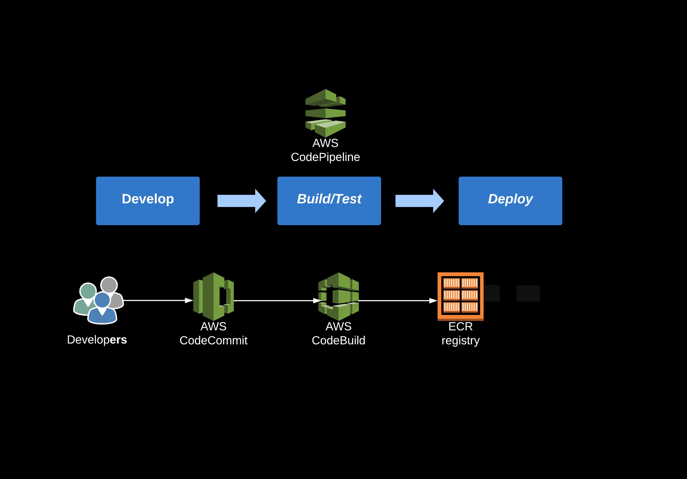
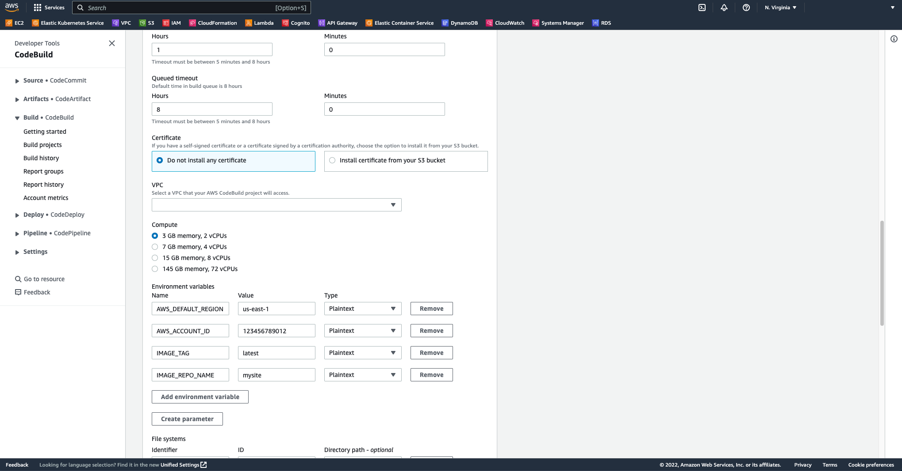

# How to Build a CI/CD Pipeline with AWS CodeCommit, CodeBuild and CodePipeline to deploy images to AWS ECR 


## What is AWS CodeCommit

AWS CodeCommit is a version control service hosted by AWS. It's used to store and manage codes, binary files, documents and more in the cloud. 

## What is AWS CodeBuild

AWS CodeBuild is a fully managed continuous integration service that compiles source code, runs tests, and produces software packages that are ready to deploy. AWS CodeBuild eliminates the need to provision, manage, and scale your own build servers. It scales continuously and processes multiple builds concurrently, so your builds are not left waiting in a queue. You can get started quickly by using prepackaged build environments, or you can create custom build environments that use your own build tools. AWS CodeBuild fully supports the buildspec file, which is a YAML file that defines the build commands and the build environment for your project.

## What is AWS CodePipeline

AWS CodePipeline is a fully managed continuous delivery service that helps you automate your release pipelines for fast and reliable application and infrastructure updates. AWS CodePipeline automates the build, test, and deploy phases of your release process every time there is a code change, based on the release model you define. You can model complex release processes that span multiple AWS services, including AWS CodeBuild, AWS CodeDeploy, AWS CodeStar, and AWS CloudFormation. You can also integrate third-party tools such as GitHub, Jenkins, and Puppet. With AWS CodePipeline, you can quickly respond to customer feedback by releasing new features, fixes, and updates frequently.

## What is AWS ECR

Amazon Elastic Container Registry (Amazon ECR) is a fully managed container registry that makes it easy for developers to store, manage, and deploy Docker container images. Amazon ECR provides both public and private registries to host your container images. You can use the familiar Docker CLI to push, pull, and manage images. Amazon ECR integrates with IAM to provide resource-level permissions, so you can grant users and applications access to repositories and images. You can use Amazon ECR as a standalone registry or as a fully integrated AWS CodePipeline registry.


---

## Architecture Diagram

The following diagram shows the architecture of the CI/CD pipeline that we will build in this lab. The pipeline will be triggered by pushing a commit to the AWS CodeCommit repository. The pipeline will then build the Docker image and push it to the AWS ECR repository. 




---


## Step 1: Initial configuration of AWS CodeCommit (Linux, macOS or Unix)

#### Part 1: Create IAM user and attach policy

1. Login to AWS console and go to AWS CodeCommit service
2. Create IAM user with "Programmatic access"
3. Attach "AWSCodeCommitFullAccess" or "AWSCodeCommitPowerUser" policy to the IAM user
4. Save the `Access key ID` and `Secret access key`

#### Part 2: How to configure AWS CLI

1. Install [AWS CLI version 2](https://docs.aws.amazon.com/cli/latest/userguide/getting-started-install.html) on your local device. 
2. Configure AWS CLI with IAM user credentials by running the following command:

```bash
aws configure --profile <profile_name>
```
>Note: the `<profile_name>` is the name of the profile you want to use. You can use any name you want. Also, you will be asked to enter AWS Access Key ID, AWS Secret Access Key, Default region name and Default output format

3. Install [Git](https://git-scm.com/book/en/v2/Getting-Started-Installing-Git) on your local device.
4. Configure Git with IAM user credentials by running the following commands:

```bash
git config --global credential.helper '!aws --profile <profile_name> codecommit credential-helper $@'
git config --global credential.UseHttpPath true
```

>Note: replace `<profile_name>` with the profile name you used in the previous step. The Git credential helper writes the result values of the above commands to `~/.git-credentials` file. You may run `git config --global --edit` to view or edit the configuration values.


**Important:** 
- If you had any issues with the above steps on macOS, please refer to this [AWS documentation](https://docs.aws.amazon.com/codecommit/latest/userguide/setting-up-https-unixes.html#:~:text=is%20configured%20correctly.-,If%20you%20are%20using%20macOS,-%2C%20use%20HTTPS%20to) for troubleshooting. 

- For more details about how to configure AWS CLI and Git on Windows, please refer to this [AWS documentation](https://docs.aws.amazon.com/codecommit/latest/userguide/setting-up-https-windows.html)

---


## Step 2: How to create AWS CodeCommit repository

1. Login to AWS console and go to AWS CodeCommit service
2. Click on "Create repository" button
3. Enter repository name and description
4. Click on "Create repository" button

---


#### Step 3: How to configure AWS CodeCommit repository locally (on your local device)

1. Login to AWS console and go to AWS CodeCommit service
2. Click on "Clone URL" button and copy the HTTPS URL
3. Open terminal on your local device. Navigate to the directory where you want to clone the repository and run the following command:

```bash
git clone <HTTPS_URL>
```
>Note: replace `<HTTPS_URL>` with the HTTPS URL you copied in the previous step


**Important:** if you have configure your IAM user credentials correctly, you will not be asked to enter your username and password. If you are asked to enter your username and password, please refer to the previous steps to configure your IAM user credentials correctly.

---


## Step 4: Download a sample website and push it to AWS CodeCommit repository

1. Download the sample website in the repository directory by running the following command:

```bash
wget https://github.com/OmarCloud20/GreatLearning-Sessions/raw/main/Containers-AWS-DevOps/Week-3/mysite.zip
```
2. Unzip the downloaded file by running the following command:

```bash
unzip mysite.zip
```
3. Move all files in the `mysite` directory to the repository directory by running the following command:

```bash
mv mysite/* .
```

4. Remove the downloaded zip file and `mysite` directory by running the following command:


```bash
rm -rf mysite.zip mysite
```

5. Add the files to the staging area by running the following command:

```bash
git add .
```
6. Commit the changes by running the following command:

```bash
git commit -m "Initial commit"
```
7. Push the changes to AWS CodeCommit repository by running the following command:

```bash
git push
```
8. Go to AWS CodeCommit service and verify that the files are pushed to the repository

---

## Step 5: Create an AWS ECR repository

1. Login to AWS console and go to AWS ECR service
2. Click on "Create repository" button
3. Enter repository name as `mysite` and click on "Create repository" button

---

## Step 6: Create an AWS Pipeline to build and push images to AWS ECR

1. Login to AWS console and go to AWS CodePipeline service
2. Click on "Create pipeline" button
3. Enter pipeline name as `mysite` and click on "Next" button
4. Select "New service role" and check "Allow AWS CodePipeline to create a service role for you" checkbox and click on "Next" button
5. Select "AWS CodeCommit" as source provider and select the repository you created, in the previous step (we should have one branch, master). Click on "Next" button
6. Select "AWS CodeBuild" as build provider and click on "Create project" button. A new window will open.
7. Enter project name as `mysite` and under "Environment" section, select the following:
   - Environment image: Managed image
   - Operating system: Ubuntu
   - Runtime: Standard
   - Image: aws/codebuild/standard:5.0
   - Image version: Always use the latest image for this runtime version
   - Privileged: Yes (required for Docker commands)
   - Service role: New service role

**Important:** capture the name of the service role created for the CodeBuild project. We need it in one of the next steps.



8. Under "Environment" section, click on "Additional configuration". Under "Environment variables", click on "Add environment variable" button and enter the following:

    | Name              | Value                         |     Type     |
    | :----------------:| :---------------------------: |  :--------:  |
    | AWS_DEFAULT_REGION| us-east-1                     |   Plaintext  | 
    | AWS_ACCOUNT_ID    | your-aws-account-#            |   Plaintext  |
    | IMAGE_TAG         | latest                        |   Plaintext  |
    | IMAGE_REPO_NAME   | your-ECR-repo-name (not URI)  |   Plaintext  |

9. Finally, click on "Continue to CodePipeline" button
10. Automatically, we are back to the "Create project" window. Open a second tab in your browser and go to IAM role service. Search for the service role you captured in the previous step and add the following inline policy:

```json
{
    "Version": "2012-10-17",
    "Statement": [
        {
            "Sid": "VisualEditor0",
            "Effect": "Allow",
            "Action": [
                "ecr:BatchCheckLayerAvailability",
                "ecr:CompleteLayerUpload",
                "ecr:GetAuthorizationToken",
                "ecr:InitiateLayerUpload",
                "ecr:PutImage",
                "ecr:UploadLayerPart"
            ],
            "Resource": "*"
        }
    ]
}
```

>Note: this policy allows the CodeBuild project to push Docker images to the ECR repository.

11. From `Add build stage` screen, click on "Next" button
12. Skip the "Add deploy stage" screen by clicking on "Skip deploy stage" button
13. Finally, click on "Create pipeline" button

**Important:** monitor the pipeline execution. If the pipeline execution fails, please check the logs of the CodeBuild project to troubleshoot the issue.

14. Go to AWS ECR service and verify that the Docker image is pushed to the repository

---

## Conclusion

In this tutorial, we learned how to create an AWS CodeCommit repository and how to push files to it. We also learned how to create an AWS ECR repository and how to create an AWS Pipeline to build and push Docker images to the ECR repository.

I hope you enjoyed this tutorial. If you have any questions, please feel free to reach out to me.

---

