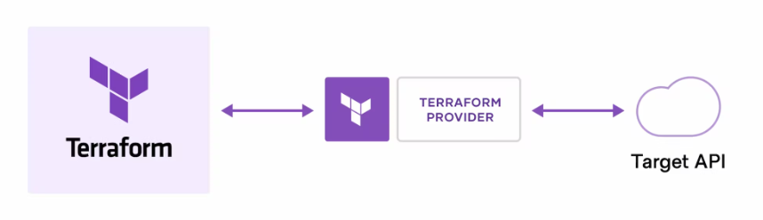
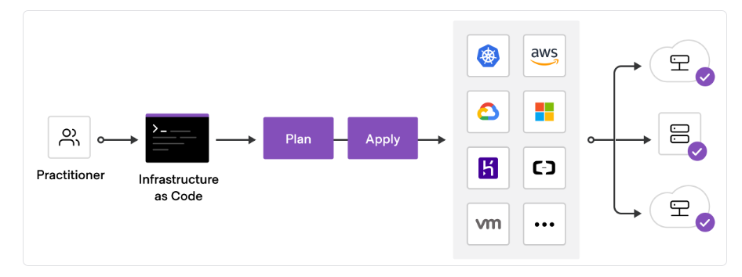
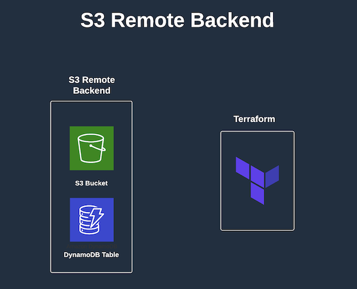

# Terraform Basics Tutorial - Updated


### Table of Contents:

<!-- TOC -->
- [What is Terraform](#what-is-terraform)
    - [Terraform Blocks](#terraform-blocks)
    - [Terraform Deployment Workflow](#terraform-deployment-workflow)
    - [State and Lock Files](#state-and-lock-files)
    - [Terraform Local Backend vs. Remote Backend](#terraform-local-backend-vs-remote-backend)
- [Terraform Installation](#terraform-installation)
    - [Prerequisite](#prerequisite) 
    - [Install Terraform](#install-terraform)
- Terraform Tutorials
    - [local-backend](#terraform-tutorial-1-local-backend)
    - [remote-backend](#terraform-tutorial-2-s3-backend)
    - [Deploy Apache Web Server](#terraform-tutorial-3-deploy-apache-web-server)
- [Conclusion](#conclusion)
- [Terraform Resource](#terraform-resource)
---


### What is Terraform:

[Terraform](https://www.terraform.io/) is an open-source cloud agnostic infrastructure as code software tool written in Go created by HashiCorp. Users define and provide cloud infrastructure using a declarative configuration language known as HashiCorp Configuration Language, or optionally JSON. Terraform generates an execution plan describing what it will do to reach the desired state, and then executes it to build the described infrastructure. As the configuration changes, Terraform is able to determine what changed and create incremental execution plans which can be applied.

Terraform can manage existing and popular service providers as well as custom in-house solutions. Infrastructure can be managed with a high-level configuration language. It codifies APIs into declarative configuration files that can be shared amongst team members, treated as code, edited, reviewed, and versioned.




#### Terraform Blocks

A Terraform configuration file consists of a sequence of blocks, which represents the components of infrastructure. A block has a block type, a label, and zero or more arguments. The block type and label are used to identify the block. The arguments are used to configure the block.

Terraform Blocks:

1. Terraform Block: The top-level block in every Terraform configuration file, which describes which Terraform version the configuration is written for.
2. Provider Block: Declares a provider configuration, which is a named configuration for a particular provider.
3. Resource Block: Declares a resource, which is a component of infrastructure.
4. Data Block: Declares a data source, which is a read-only data source configuration.
5. Variable Block: Declares a variable, which is a user-defined input variable.
6. Output Block: Declares an output, which is a user-defined output value.


#### Terraform Deployment Workflow

To deploy infrastructure using Terraform, you need to follow the following steps:

1. Write a Terraform configuration file
2. Initialize the working directory
3. Plan changes to the infrastructure
4. Apply the changes to the infrastructure
5. Destroy the infrastructure (optional)





#### State and Lock Files

Terraform stores the state of the infrastructure it manages in a state file. By default, the state file is stored locally in a file named terraform.tfstate. This file is used by Terraform to map the real-world resources to your configuration, keep track of metadata, and to improve performance for large infrastructures. The file is created automatically when you run terraform apply for the first time.
The state lock file is used to prevent multiple users from modifying the state file at the same time. By default, the state lock file is stored locally in a file named terraform.tfstate.lock.info. This file is also created automatically when you run terraform apply for the first time.


#### Terraform Registry

The [Terraform Registry](https://registry.terraform.io/) is a repository of Terraform modules, providers, and plugins. It is a central place to find, share, and reuse Terraform configurations. The Terraform Registry is a service provided by HashiCorp. It is free to use and open source. 

For example, if you want to deploy an EC2 instance, you can use the [aws_instance](https://registry.terraform.io/providers/hashicorp/aws/latest/docs/resources/instance) resource from the [AWS provider](https://registry.terraform.io/providers/hashicorp/aws/latest/docs). The AWS provider is a plugin that is used to interact with the many resources supported by AWS. The document for the aws_instance resource contains all the arguments that can be used to configure the resource. The document also contains the attributes that are exported by the resource. The attributes can be used to reference the resource in other resources. For example, the aws_instance resource exports the public_ip attribute, which can be used to reference the public IP address of the EC2 instance in other resources.


#### Terraform Local Backend vs. Remote Backend

Terraform uses a local backend by default. This means that the state file is stored locally on the machine where Terraform is executed. This is fine for a single user, but if you are working in a team, you will need to use a remote backend. Terraform supports a number of remote backends, including S3, Consul, and Terraform Enterprise. The remote backend is configured in the terraform block of the Terraform configuration file. For an S3 remote backend, DynamoDB is also required to store the state lock file. 
In this tutorial, we will go over how to configure a local backend and a remote backend. This will allow us to understand the difference between local and remote backends.




<br>

---

### Terraform Installation:

#### Prerequisite:

- [ ] Install [Visual Studio Code](https://code.visualstudio.com/download)
- [ ] Access to [AWS](https://aws.amazon.com/) account
- [ ] Install [AWS CLI](https://docs.aws.amazon.com/cli/latest/userguide/getting-started-install.html)

>Note: Visual Studio Code is not a requirement, you can use any text editor of your choice. Terraform authentication with AWS is done using AWS CLI. You will need to configure AWS CLI with your AWS credentials. You can find the instructions [here](https://docs.aws.amazon.com/cli/latest/userguide/cli-chap-configure.html). We will be using named profile in this tutorial. 


#### Install Terraform:

1. Download and install Terraform for your operating system from [here](https://developer.hashicorp.com/terraform/downloads?ajs_aid=8b92b5d2-953b-4a69-9a51-156b841d9dca&product_intent=terraform)
2. Verify the installation by running the following command in your terminal:

```bash
terraform --version
```

---

### Terraform Tutorial 1: Local Backend

During this tutorial, we will provision an EC2 instance using Terraform. We will use a local backend to store the state file and lock file. 


1. Create a new directory and open it in Visual Studio Code.

```bash
mkdir terraform-tutorial
cd terraform-tutorial
code .
```

2. Create a new file named `main.tf` and add the following code. The `.tf` extension is used to identify Terraform configuration files.


```hcl 
terraform {
  required_providers {
    aws = {
      source = "hashicorp/aws"
      version = "~>4.0"
    }
  }
}

provider "aws" {
  region = "us-east-1"
  profile = "Terraform"
}

resource "aws_instance" "example" {
  ami           = "ami-0b0dcb5067f052a63"
  instance_type = "t2.micro"
}
```

>Note: the Amazon Machine Image (AMI) are region specific. You can find the AMI for your region. Therefore, this AMI will only work in the us-east-1 region. Also, replace the profile `Terraform` with the name of your AWS profile you have configured using the AWS CLI.


<br>

**Important:**


- The `terraform` block is used to configure the Terraform backend. In this case, we are using a local backend. The `required_providers` block is used to configure the provider. In this case, we are using the AWS provider. The `provider` block is used to configure the provider. In this case, we are using the AWS provider. The `resource` block is used to configure the resource. In this case, we are using the AWS instance resource.

- The `terraform` block is required in every Terraform configuration file. The `required_providers` block is required if you are using a provider that is not installed by default. The `provider` block is required if you are using a provider that is not installed by default. The `resource` block is required if you are using a resource that is not installed by default.

- All blocks are obtained from the [Terraform Registry](https://registry.terraform.io/).

3. Run `terraform fmt` to format the configuration file. This is not required, but it is a good practice to format the configuration file.

```bash
terraform fmt
```

4. Initialize the working directory by running the following command:

```bash
terraform init
```
5. Run `terraform validate` to validate the Terraform configuration file. This command will check for syntax errors in the Terraform configuration file.

```bash
terraform validate
```

6. Run the following command to see the changes that will be made:

```bash
terraform plan
```

7. Run the following command to apply the changes:

```bash
terraform apply
```

8. Run the following command to see the resources that have been created:

```bash
terraform show
```

>Note: this command is used to show the current state of the infrastructure. It's not necessary to run this command after every `terraform apply` command. It's only used to see the current state of the infrastructure.


9. Run the following command to destroy the resources that have been created:

```bash
terraform destroy
```

---

### Terraform Tutorial 2: S3 Remote Backend

During this tutorial, we will provision an EC2 instance using Terraform. We will use an S3 remote backend to store the state file and lock file. We will also use DynamoDB to store the state lock file. We won't use Terraform to provision the S3 bucket and DynamoDB table. We will provision them manually from the AWS console.

1. Create an S3 bucket in AWS and name it `terraform-tutorial-remote-backend-xxxxxx`. Replace `xxxxxx` with your name.

>Note: S3 bucket names must be unique across all existing bucket names in Amazon S3.

2. Create a DynamoDB table in AWS and name it `terraform-tutorial-remote-backend-lock` and the primary key as `LockID`.

3. Create a new file named `backend.tf` and add the following code:

```hcl
terraform {
  backend "s3" {
    bucket         = "terraform-tutorial-remote-backend-xxxxx"
    key            = "terraform.tfstate"
    encrypt        = true
    region         = "us-east-1"
    dynamodb_table = "terraform-tutorial-remote-backend-lock"
    profile        = "Terraform"
  }
}
```

4. Create a file named `main.tf` (no need to create a new file if you still have the one from the previous tutorial) and add the following code:

```hcl
terraform {
  required_providers {
    aws = {
      source = "hashicorp/aws"
      version = "~>4.0"
    }
  }
}

provider "aws" {
  region = "us-east-1"
  profile = "Terraform"
}

resource "aws_instance" "example" {
  ami           = "ami-0b0dcb5067f052a63"
  instance_type = "t2.micro"
}
```

>Note: Terraform allows for acceptance of version constraints for providers. This allows you to specify a minimum version of a provider or Terraform version as well as a maximum version of a provider or a Terraform version by using constraint syntax such as, `>= 1.0.0, < 2.0.0`. You can find more information [here](https://www.terraform.io/docs/language/providers/requirements.html#version-constraints).


5. Initialize the working directory by running the following command:

```bash
terraform init
```

6. Run the following command to see the changes that will be made:

```bash
terraform plan
```

7. Run the following command to apply the changes:

```bash
terraform apply
```

8. Run the following command to see the resources that have been created:

```bash
terraform show
```

9. Run the following command to destroy the resources that have been created:

```bash
terraform destroy
```

---

### Terraform Tutorial 3: Deploy Apache Web Server

During this tutorial, we will provision an EC2 instance using Terraform and use an S3 remote backend. The EC2 is the Apache web server. 

>Note: there is no need to recreate the below backend.tf file. You can use the one from the previous tutorial.


1. Create a file named `backend.tf` and add the following code:

```hcl
terraform {
  backend "s3" {
    bucket         = "terraform-tutorial-remote-backend-xxxxx"
    key            = "terraform.tfstate"
    encrypt        = true
    region         = "us-east-1"
    dynamodb_table = "terraform-tutorial-remote-backend-lock"
    profile        = "Terraform"
  }
}
```

2. Create a file named `main.tf` or replace the one from the previous tutorial with the following code:

```hcl
terraform {
  required_providers {
    aws = {
      source = "hashicorp/aws"
      version = "~>4.0"
    }
  }
}

provider "aws" {
  region = "us-east-1"
  profile = "Terraform"
}

resource "aws_security_group" "allow_http" {
  name        = "allow_http"
  description = "Allow http inbound traffic"

  ingress {
    description = "Open http port"
    from_port   = 80
    to_port     = 80
    protocol    = "tcp"
    cidr_blocks = ["0.0.0.0/0"]
    }
  egress {
    from_port = 0
    to_port = 0
    protocol = "-1"
    cidr_blocks = ["0.0.0.0/0"]
    }
}

resource "aws_instance" "example" {
  ami           = "ami-0b0dcb5067f052a63"
  instance_type = "t2.micro"
  vpc_security_group_ids = [aws_security_group.allow_http.id]

  user_data = <<-EOF
              #!/bin/bash
              sudo yum update -y
              sudo yum install httpd -y
              sudo systemctl start httpd
              sudo systemctl enable httpd
              echo "Hello World - I made it" | sudo tee /var/www/html/index.html
              EOF
}
```

>Note: we are using the `user_data` argument to provision the Apache web server. We are also using the `aws_security_group` resource to allow inbound traffic on port 80.


3. Initialize the working directory by running the following command:

```bash
terraform init
```

4. Run the following command to see the changes that will be made:

```bash
terraform plan
```

5. Run the following command to apply the changes:

```bash
terraform apply
```

6. Run the following command to destroy the resources that have been created:

```bash
terraform destroy
```
>Note: you will need to manually delete the S3 bucket and DynamoDB table.

---

### Conclusion

In this tutorial, we learned Terraform basics and how to provision resources in AWS using Terraform. We also learned how to use an S3 remote backend to store the state file and lock file. We also learned how to provision an Apache web server on an EC2 instance and how to allow inbound traffic on port 80 using Terraform.

Now, we are ready to move to more complex IaC projects. I wish you the best of luck on your Terraform journey.


---


### Terraform Resource:

- [Terraform Associate Certification](https://www.hashicorp.com/certification/terraform-associate)
- [Terraform Providers](https://www.terraform.io/docs/providers/index.html)
- [Terraform Resources](https://www.terraform.io/docs/configuration/resources.html)
- [Terraform Data Sources](https://www.terraform.io/docs/configuration/data-sources.html)
- [Terraform Modules](https://www.terraform.io/docs/configuration/modules.html)
- [Terraform Backends](https://www.terraform.io/docs/backends/index.html)

---
